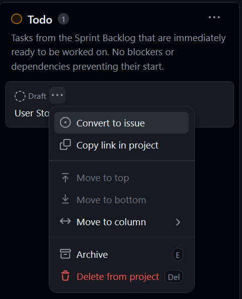
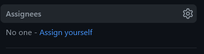
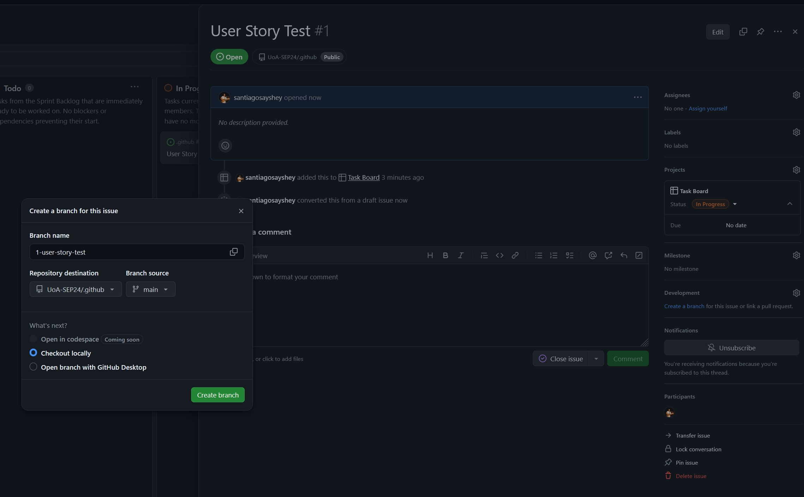

# Workflow Guidelines

## Sprint Planning and Backlog Management

1. Product Backlog:
    - The Product Owner creates user stories as cards in the project board.
    - These cards are placed in the "Product Backlog" column.
    - Each card is labeled with "User Story" for clear identification.
    - At this stage, user stories are not assigned to any specific repository or team member.
    - The Product Owner prioritizes these user stories within the Product Backlog based on business value and other relevant factors.

2. Sprint Planning:
   - The team selects user stories for the sprint.
   - Selected user stories move from Product Backlog to Sprint Backlog.

```
Example of Sprint Planning:
   - Product Backlog:
     1. "As a user, I want to log in to the application" (High Priority)
     2. "As a user, I want to reset my password" (Medium Priority)
     3. "As a user, I want to view my profile" (Low Priority)
   
   - After Sprint Planning:
     - Sprint Backlog:
       1. "As a user, I want to log in to the application"
       2. "As a user, I want to reset my password"
     - Remaining in Product Backlog:
       3. "As a user, I want to view my profile"
```

3. Task Creation and Management:
   - During sprint planning, the development team breaks down selected user stories into smaller, technical tasks.
   - Create new issues for each task in the appropriate repository (e.g., frontend, backend).
   - Each task issue is linked to its parent user story for traceability.
   - Tasks are initially placed in the "Sprint Backlog" column of the project board.
   - Only move tasks to "To Do" when they are ready to be worked on immediately.

```
Example of Task Flow:
   - User Story: "As a user, I want to log in to the application"
     1. Task: "Implement basic email/password authentication" (moved to "To Do")
     2. Task: "Implement OAuth integration" (stays in "Sprint Backlog")
   - The OAuth task is only moved to "To Do" once the basic authentication is completed.
```


## Development Workflow

1. Starting Work:
   - Choose a task from the "To Do" column on the project board.
   - Convert the task into an issue and choose the appropriate repository.

   

   - Assign the task to yourself if not already assigned.

   


2. Branch Creation:
   - Create a new branch for your task. Make sure to select the current sprint branch as the branch source.
   - Naming convention: `type/issue-number-brief-description`
   - Example: `feature/42-add-login-form` or `bugfix/57-fix-login-validation`
   - See the [Glossary](#glossary) for a list of branch types.
   - Checkout the new branch locally, and start working on the task.

   ```
   git checkout -b feature/42-add-login-form
   ```




3. Development:
   - Make changes following the project's coding standards.
   - Commit frequently according to the commit message guidelines.
...

### Commit Message Guidelines:
   - Structure your commit message as follows:
     ```
     <type>(<scope>): <subject>

     <body>

     <footer>
     ```

   - Refer to the [Commits](#commit-types-with-examples) for more information on best practices.


4. Pushing Changes:
   - Push your changes to the remote branch:
     ```
     git push origin feature/42-add-login-form
     ```

5. Creating a Pull Request (PR):
   - Create a PR to merge your branch into the sprint branch.
   - Fill in the PR template with a clear title and description.
   - Link the PR to the relevant task issue.
   - Request reviews from team members.

   Example PR title: "Feature: Add user login form (#42)"

   Example PR description:
   ```
   This PR implements the user login form as described in issue #42.

   Changes made:
   - Created a responsive login form
   - Implemented client-side validation
   - Added unit tests for form validation logic

   Please review the form layout and validation logic.

   Closes #42
   ```

[TODO: Space for image: Screenshot of creating a PR in GitHub]

6. Code Review:
   - Address feedback by making new commits to your branch.
   - Update the PR by pushing these new commits.

   Example of addressing feedback:
   ```
   git commit -m "Refactor form validation as per review comments"
   git push origin feature/42-add-login-form
   ```

[TODO: Space for image: Screenshot of review comments and updates in GitHub]

7. Merging:
   - Once approved and all checks pass, merge the PR into the sprint branch.
   - Delete the feature branch after merging.
   - Move the task to "Done" on the project board.
   - If this completes the user story, move it to "Done" as well.

8. Sprint Review and Retrospective

- At the end of the sprint:
  - Review completed user stories and tasks.
  - Merge the sprint branch into the main branch.
  - Create a new sprint branch for the next sprint.
  - Move incomplete user stories back to the Product Backlog or to the next sprint's backlog, as decided by the team.

## Glossary

### Branch Types
- **Feature**: New functionality being added to the project
- **Bugfix**: Correcting an error in existing functionality
- **Hotfix**: Urgent fix for a critical issue in production
- **Refactor**: Improving code structure without changing its behavior
- **Docs**: Changes to documentation
- **Test**: Adding or modifying tests
- **Chore**: Routine tasks, maintenance, or tooling updates

Example branch names:
- `feature/42-add-user-registration`
- `bugfix/57-fix-password-reset`
- `hotfix/63-critical-security-patch`
- `refactor/72-optimize-database-queries`
- `docs/81-update-readme`
- `test/95-add-integration-tests`
- `chore/103-update-dependencies`

### Commit Types with Examples
- **feat**: A new feature
  Example: `feat(auth): Add user registration form`

- **fix**: A bug fix
  Example: `fix(login): Correct email validation regex`

- **docs**: Documentation changes
  Example: `docs(readme): Update installation instructions`

- **style**: Changes that do not affect the meaning of the code (formatting, etc.)
  Example: `style(global): Apply consistent indentation`

- **refactor**: Code change that neither fixes a bug nor adds a feature
  Example: `refactor(database): Optimize user query performance`

- **test**: Adding or modifying tests
  Example: `test(api): Add unit tests for user authentication`

- **chore**: Changes to build process or auxiliary tools
  Example: `chore(deps): Update dependencies to latest versions`

Example of a detailed commit message:
```
feat(auth): Implement two-factor authentication

- Add option for users to enable 2FA
- Implement TOTP (Time-based One-Time Password) generation
- Create UI for 2FA setup and verification

This feature enhances account security by allowing users to add an extra 
layer of protection to their login process.

Closes #123
```

## Additional Best Practices

- Keep your branch up to date with the sprint branch regularly.
- Participate in daily stand-ups to communicate progress and blockers.
- Ensure your work meets the team's Definition of Done before submitting for review.
- Use clear, descriptive titles for issues and PRs.
- Regularly update the status of your tasks on the project board.


