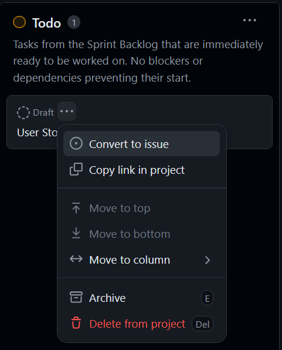
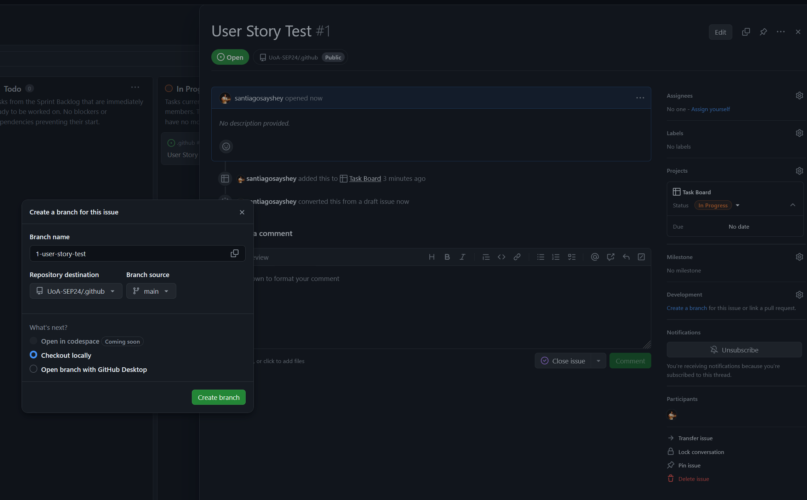

# Development Workflow

1. Starting Work:
   - Choose a task from the "To Do" column on the project board.
   - Convert the task into an issue and choose the appropriate repository.

   

   - Assign the task to yourself if not already assigned.

   


2. Branch Creation:
   - Create a new branch for your task. Make sure to select the current sprint branch as the branch source.
   - Naming convention: `type/issue-number-brief-description`
   - Example: `feature/42-add-login-form` or `bugfix/57-fix-login-validation`
   - See the [Glossary](#glossary) for a list of branch types.
   - Checkout the new branch locally, and start working on the task.

   ```
   git checkout -b feature/42-add-login-form
   ```




3. Development:
   - Make changes following the project's coding standards.
   - Commit frequently according to the commit message guidelines.
...

### Commit Message Guidelines:
   - Structure your commit message as follows:
     ```
     <type>(<scope>): <subject>

     <body>

     <footer>
     ```

   - Refer to the [Commits Document](commits.md) for more information on best practices.


4. Pushing Changes:
   - Push your changes to the remote branch:
     ```
     git push origin feature/42-add-login-form
     ```

For the next steps, including creating a Pull Request and the Code Review process, please refer to the [Pull Request Process](pull-requests.md) document.